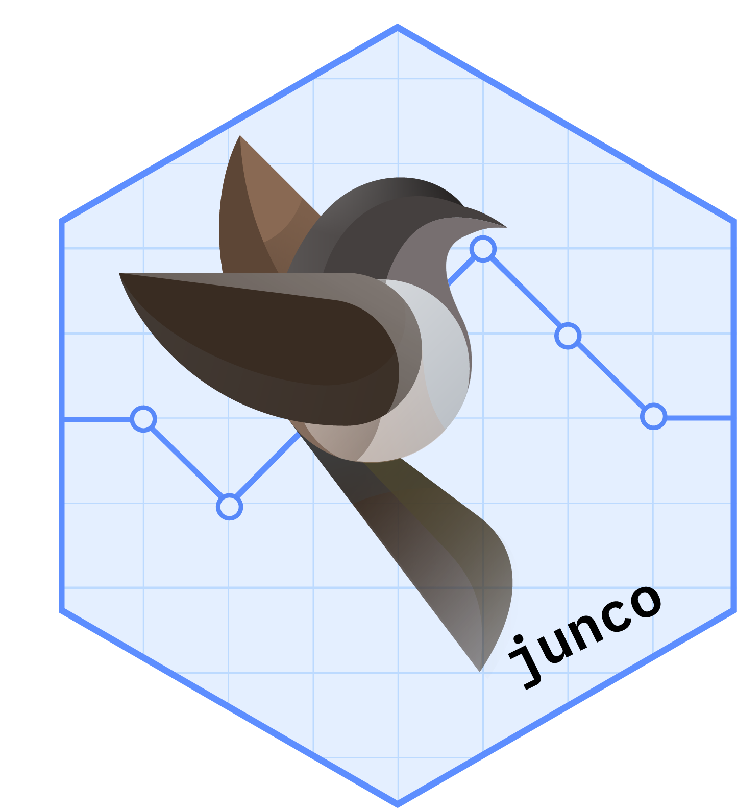
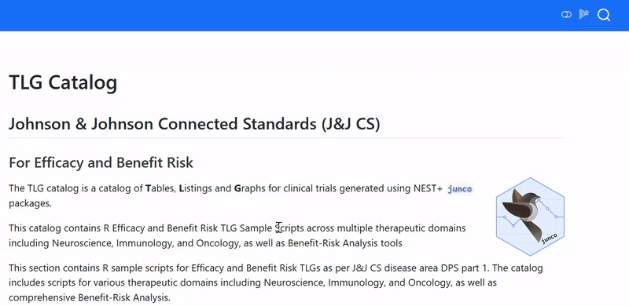

# Johnson & Johnson Innovative Medicine TL Catalog

## Introduction

The TL catalog is a catalog of **T**ables and **L**istings for clinical trials generated using NEST+ `junco` packages.

This catalog contains R template scripts for Johnson & Johnson Innovative Medicine.

Each TL is represented on a separate article page, typically including the following sections:

-   Setup and pre-processing of synthetic data.

-   Steps to produce the TL.

> **Note:** Our functions are optimized for TrueType font DOCX and RTF generation, but in this catalog we show HTML flextables for simplicity. 
> Thus, some elements differ is size and purpose. We also provide RTF downloads for true fidelity. Some listings have been shortened down for demonstration purposes.

## Usage

See the full list of available TLs on the [Index page](tlg-index.qmd).

The [reproducibility](reproducibility.qmd) section contains session information and allows one to install the packages required to properly run the code.

### Interacting with Catalog R Code

::::: columns
::: {.column style="vertical-align: middle; width: 30%; padding-right: 5%"}
One can search for any text in the search bar (i.e. reference mock)
:::

::: {.column style="vertical-align: middle; width: 65%"}

:::
:::::

## License

This catalog as well as code examples are licensed under the Apache License, Version 2.0 - see the [LICENSE](LICENSE) file for details.

## Contributing

We welcome contributions big and small to the TL catalog. 
Use the giscus panels at the bottom of each page to share your feedback & ideas, ask questions, and report issues.

## Development

This website is built using [Quarto](https://quarto.org/) and hosted on [GitHub Pages](https://pages.github.com/).

If you are adding a new table, listing, or graph in the form a new `.qmd` file, then you will also need to update the index in the [tlg-index.qmd](tlg-index.qmd) file with the new file name. 
To do so, run the R code in the [generate-index.R](generate-index.R) file after creating your template.
