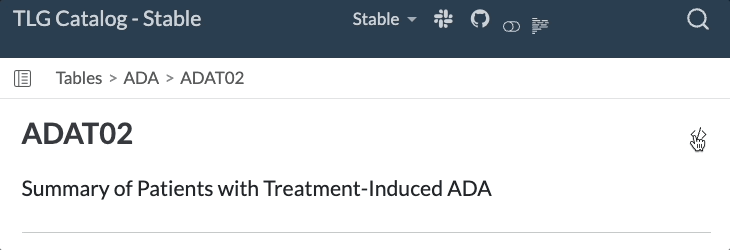
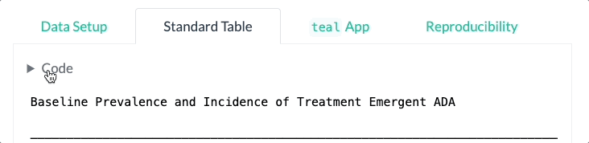

# TL Catalog

## Introduction

The TL catalog is a catalog of **T**ables, and **L**istings for clinical trials generated using NEST packages.

This repository provides a comprehensive collection of clinical trials outputs generated using the R language. The target audience is the clinical trials community, including statisticians, data scientists, and other professionals interested in applying R to clinical trials data.

## Usage

Each TL is represented on a separate article page, typically including the following sections:

-   Setup and pre-processing of synthetic data.
-   Steps to produce the TL.
-   The output TL generated by the given code (including any available variants). 
- <!-- - An interactive application that can alternatively be used to produce and interact with the TL.)
        - Reproducibility information. -->

See the full list of available TLs on the [Index page](tlg-index.qmd).

The [reproducibility](reproducibility.qmd) section contains session information and allows one to install the packages required to properly run the code.

## Notes

Some listings have been sliced down for demonstration purposes.

### Interacting with Catalog R Code

:::::::: columns
::: {.column style="vertical-align: middle; width: 30%; padding-right: 5%"}
The full source code of each article can be viewed by clicking on the "Source Code" button at the top of the page and copied using the "Copy to Clipboard" button.
:::

::: {.column style="vertical-align: middle; width: 65%"}

:::

::: {.column style="vertical-align: middle; width: 30%; padding-right: 5%"}
Individual code chunks from within the article can also be viewed and copied.
:::

::: {.column style="vertical-align: middle; width: 65%"}

:::

::::::::

## License

This catalog as well as code examples are licensed under the Apache License, Version 2.0 - see the [LICENSE](LICENSE) file for details.

## Development

This website is built using [Quarto](https://quarto.org/) and hosted on [GitHub Pages](https://pages.github.com/).

If you are adding a new table, listing, or graph in the form a new `.qmd` file, then you will also need to update the index in the [tlg-index.qmd](tlg-index.qmd) file with the new file name. 
To do so, run the R code in the [generate-index.R](generate-index.R) file after creating your template.
